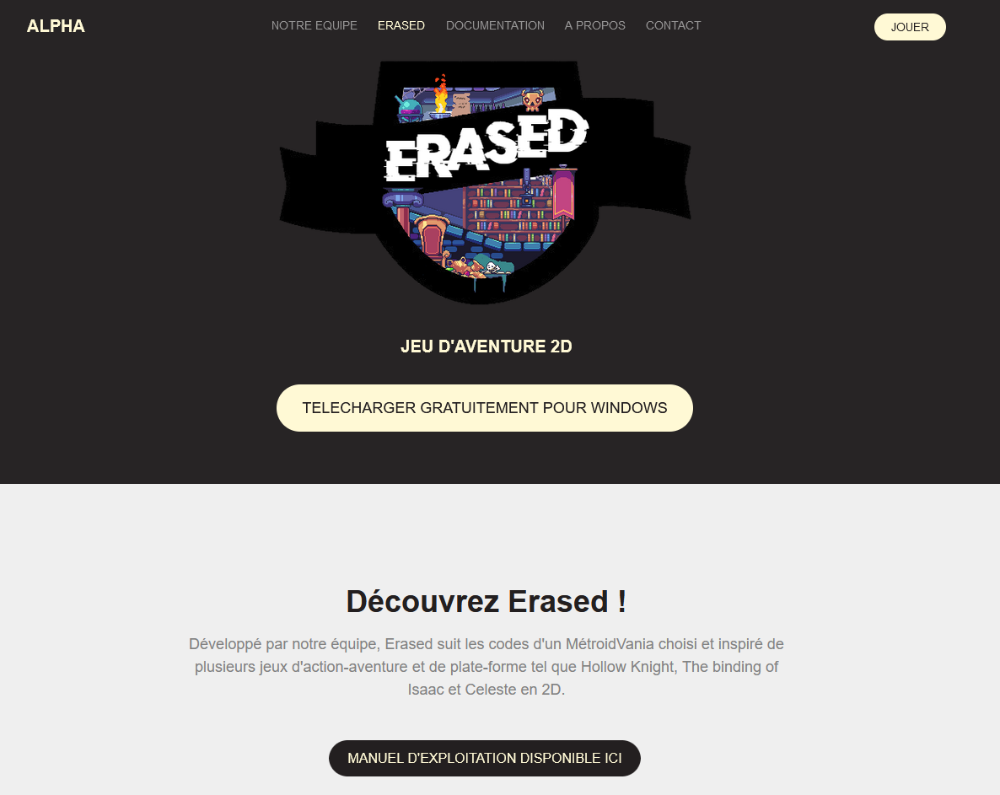
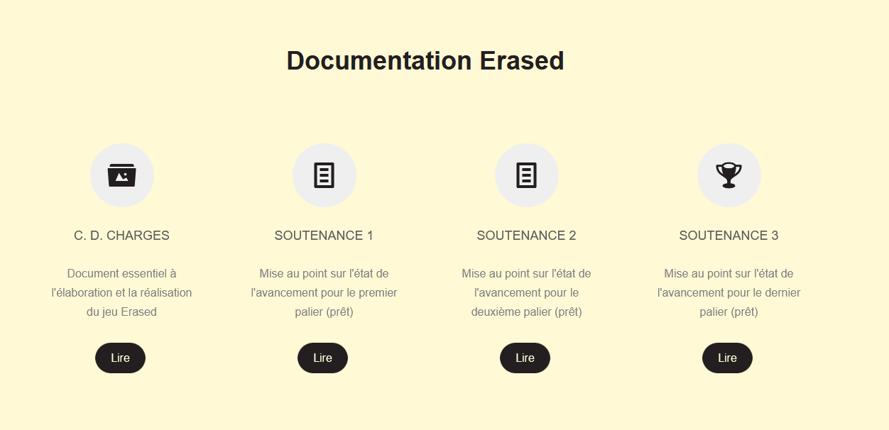
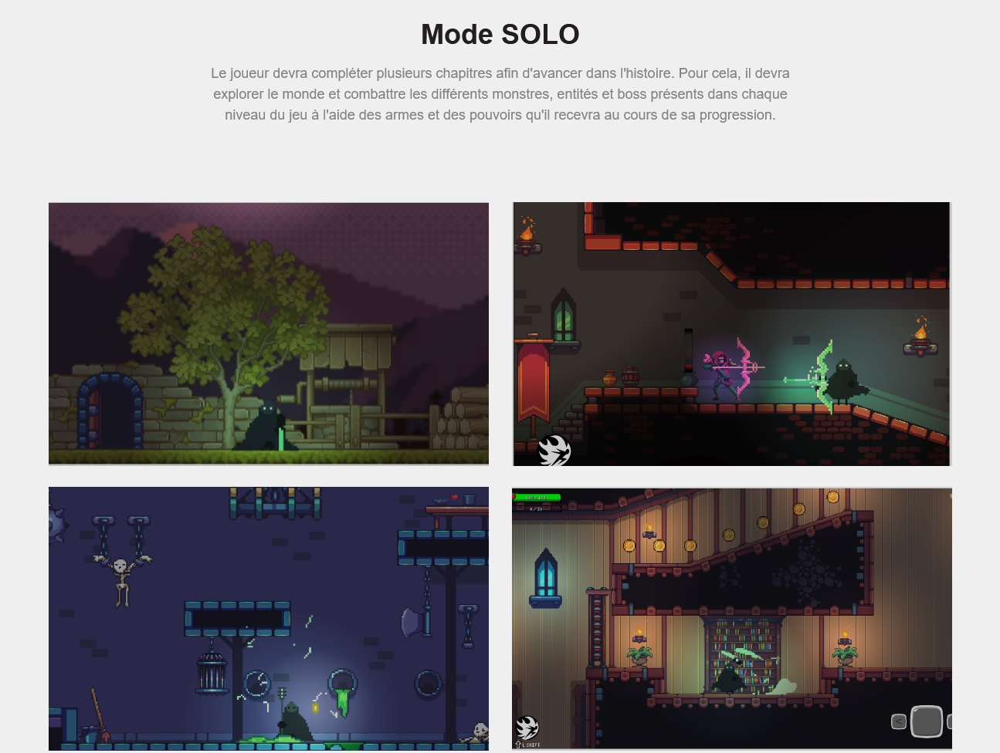
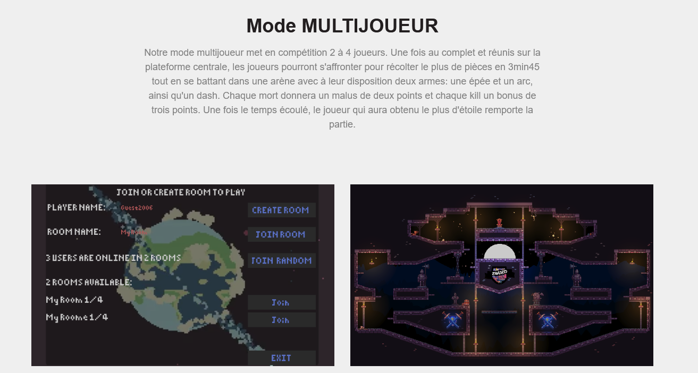
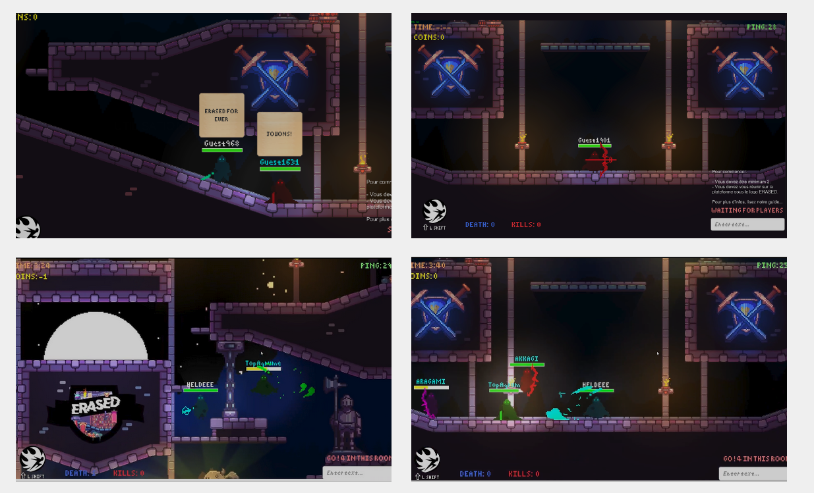

# Erased
Unity Game - Project S2 for EPITA

Erased is a Unity-based game that follows the conventions of a Metroidvania. It draws inspiration from several iconic 2D action-adventure and platformer games, including Hollow Knight, The Binding of Isaac, and Celeste.

# Trailer

https://github.com/user-attachments/assets/0a70c7c6-dece-4ec5-b442-284cf239ed75

# Install

Follow the guide `Dossier_exploitation_Erased.pdf`\
You can also find a `.exe` file in the repository

# Website

Visit the Erased [website](https://topagrume.github.io/erased/jeu.html) to find the download link and access all related documentation, including the production specifications and the project reports.

# Preview

